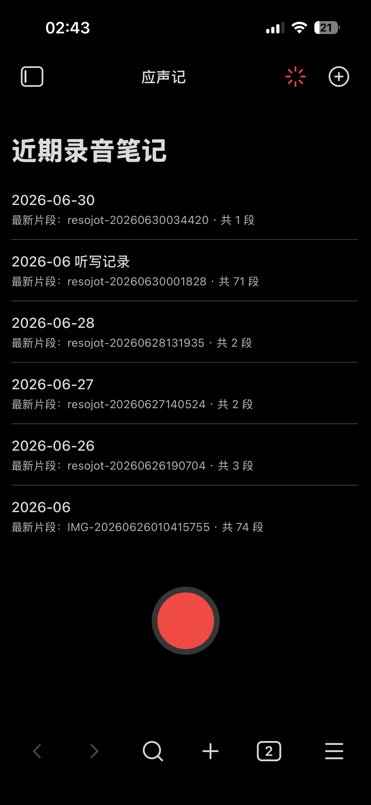
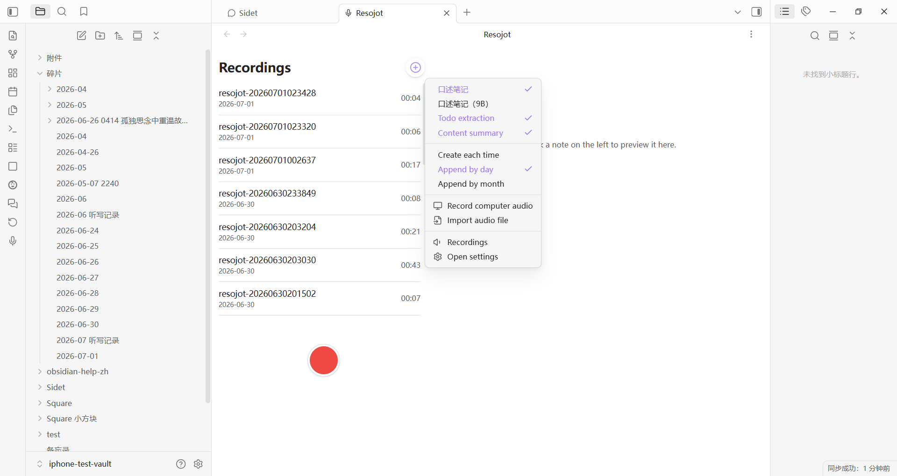
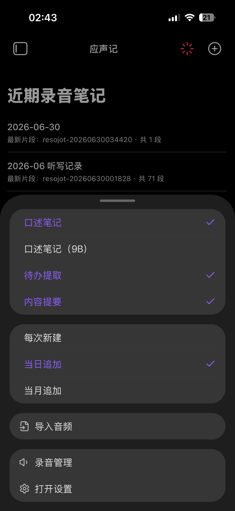
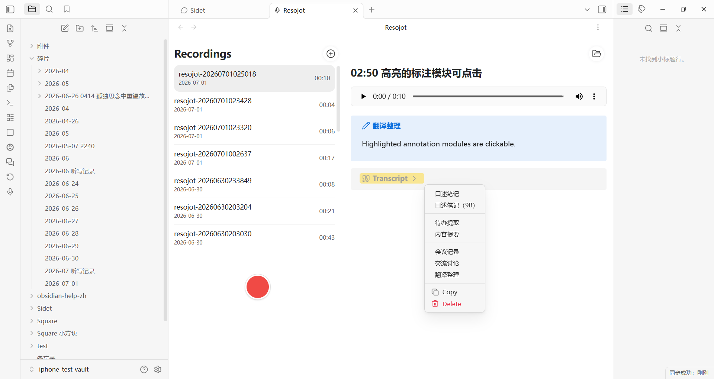
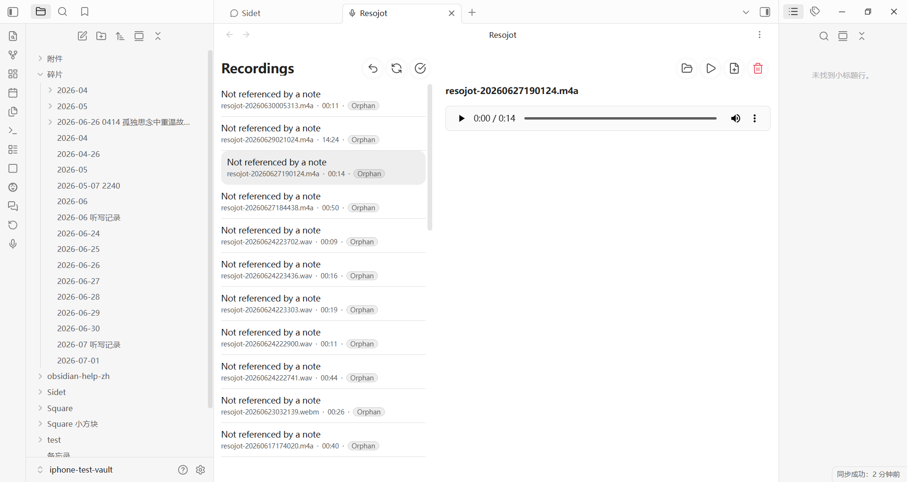
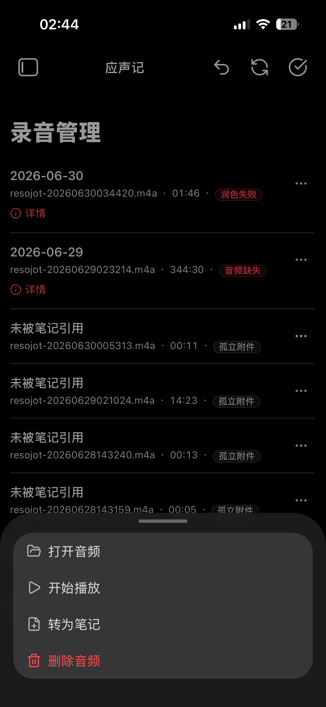
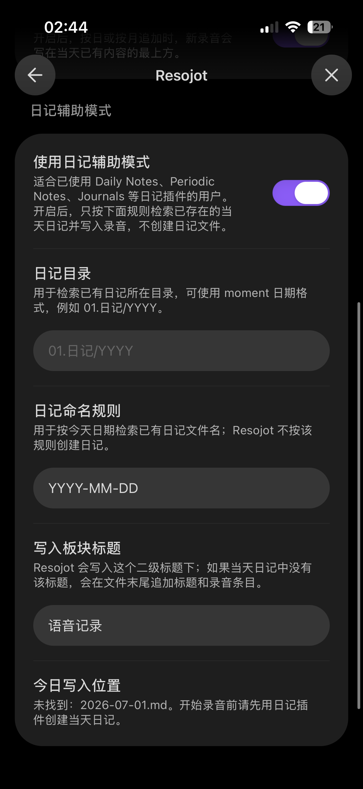
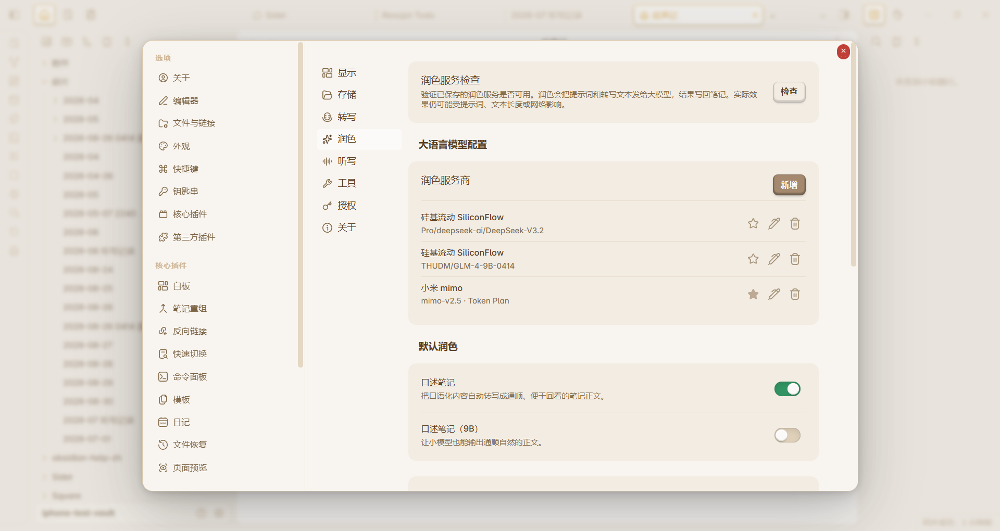
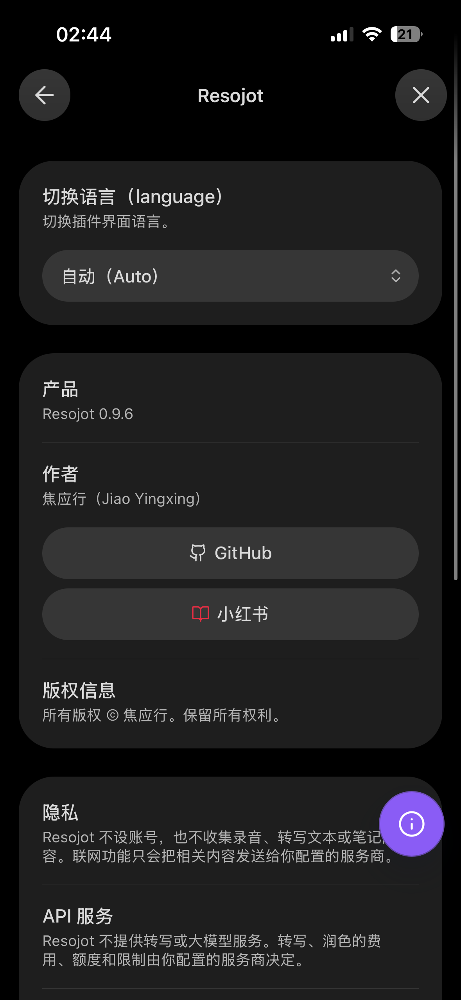

# Resojot

  
  
  
  

  <strong>Language:</strong> <strong>English</strong> · <a href="./README.md"><strong>简体中文</strong></a>

Voice recording plugin for Obsidian.

- Record audio, save it automatically, and generate Markdown notes.
- Automatic ASR transcription and LLM polishing, all handled inside Obsidian.
- Every release is tested on real iPhone, Android, and Windows devices.
- Mobile startup latency is about 40–100 ms.

## 👋 Contact

- Search for **焦应行** on Xiaohongshu to get a permanent license key.
- For support, feedback, or license access, search Xiaohongshu for **焦应行**.
- Detailed setup guides, free API guides, plugin tips, and the support group are all on Xiaohongshu.

  

## ✨ Core Capabilities

| Category | Description |
|:---|:---|
| Entry points | On desktop, start from shortcuts, commands, or buttons; on mobile, use a URL shortcut for one-tap recording |
| UI | A visual recording workspace inside Obsidian that feels like a built-in voice recorder and is easy for new users to pick up |
| Audio storage | Save audio into your Obsidian vault with per-recording, daily, or monthly organization, plus custom folders and sorting |
| Markdown notes | Create Markdown notes while recording, including audio links, structured sections, and custom note templates |
| ASR transcription | Connect to multiple ASR providers through a unified flow; provider APIs are user-configured and not bundled with quota |
| LLM polish | Polish transcription results with LLMs; prompt schemes are customizable and can be switched at any time |
| Queue and management | Pending queue, retry, and recording management features are built in |
| Independent use | Each capability can be used separately, and audio can also be imported for processing |
| Usage status | Already used by hundreds of real paying users and still being actively updated |
| i18n | Full and comprehensive English interface support |

## 🎁 Extended Capabilities

| Category | Description |
|:---|:---|
| Dictation | Use it like Typeless for speech input; recordings are saved as a fallback so nothing is lost (Windows only for now) |
| Todo | Automatically extract to-dos from recordings and collect them into a single Markdown note. The checkbox flow feels similar to iPhone Notes |
| Summary | Automatically summarize each recording into one sentence, then write it into the file name or outline |
| Internal audio | Record audio from the computer’s internal sound card, including headphone output, for classes, podcasts, and similar use cases (Windows only for now) |
| Import processing | Open the file picker, choose an audio file, and import it in one step. Transcription, polishing, and other preset processing can run automatically |
| Optional polishing | Preset workflows for meetings, study, translation, and other scenarios, with custom schemes you can call in one click |

  

## 👀 UI Preview

| Scenario | Preview |
|:---|:---|
| **Mobile quick actions** Polish schemes, write modes, audio import, and recording management are grouped into the top menu. |  |
| **Desktop dual-pane workbench** Manage recent recordings on the left, preview notes on the right, and keep common actions on the same page. |  |
| **Callout action menu** Trigger polish, Todo extraction, content summary, copy, delete, and retry directly from a note block. |  |
| **Dual-pane recording management** Review queues, failed states, and per-recording actions, with the preview pane carrying extra actions. |  |
| **Mobile recording management** Review the queue and recording states on mobile, then open item actions from the menu. |  |
| **Journal assist mode** When appending to daily notes, Resojot can target an existing journal template and write into that structure. |  |
| **Polish and add-on processing** Default polish, Todo extraction, content summary, and related schemes can be managed independently. |  |
| **About and contact entry** License state, GitHub, author contact, and feedback information are grouped in the About page. |  |

## 🔌 Supported Services

| Type | Supported |
|:---|:---|
| Transcription (ASR) | Local OpenAI-compatible endpoint (including locally deployed voxbox models) Cloud OpenAI-compatible endpoint SiliconFlow Doubao ASR Tencent Cloud ASR Aliyun DashScope ASR OpenAI Azure Speech Google Speech-to-Text |
| Polish (LLM) | OpenAI-compatible Anthropic Gemini Ollama |

> [!NOTE]
> A Resojot license does not include any third-party cloud service quota.

## 🚀 Installation

> [!WARNING]
> Resojot is a closed-source plugin and does not appear in the official Community Plugins directory.

### Option 1: BRAT (recommended)

1. Install **BRAT** from Obsidian Community Plugins
2. Open BRAT and choose **Add Beta plugin**
3. Enter `https://github.com/jiaoyingxing/resojot`
4. After installation, enable **Resojot** in Obsidian settings

> BRAT can update the plugin directly from GitHub Releases, so you usually do not need to replace files manually.

### Option 2: Manual installation

1. Download `main.js`, `manifest.json`, and `styles.css` from [GitHub Releases](https://github.com/jiaoyingxing/resojot/releases)
2. Put them into `.obsidian/plugins/resojot/` inside your vault
3. Restart Obsidian, or reload community plugins
4. Enable Resojot in Obsidian settings

## 🔐 License and Privacy

### License status

| Status | Available features |
|:---|:---|
| 🔒 Unlicensed | Recording, audio saving, basic Markdown notes, and basic templates |
| 🔓 Licensed | Automatic transcription, pending queue and retry, imported-audio transcription, AI polish, and other advanced features |

- License keys are verified locally through signature validation
- License keys do not include any third-party cloud service quota
- To get a license key, search Xiaohongshu for **焦应行**

### Data and storage

| Data | Stored in |
|:---|:---|
| 🎙️ Audio files and Markdown notes | Your Obsidian vault (local) |
| ⚙️ Plugin settings, license state, and pending task state | Local Obsidian plugin data |
| 🔑 Provider API keys, polish API keys, and license key | Obsidian SecretStorage, separated by device and vault |

- Resojot does not include client-side telemetry
- If you enable cloud transcription or cloud polish, the processed audio or text will be sent to your configured provider

> [!CAUTION]
> Do not publish `.obsidian/plugins/resojot/data.json`. It may contain settings, queue state, license state, and legacy provider credentials from older versions.

## 📜 License

- Distributed as a closed-source plugin
- Installation and updates happen through BRAT or GitHub Releases
- See [LICENSE](./LICENSE)
