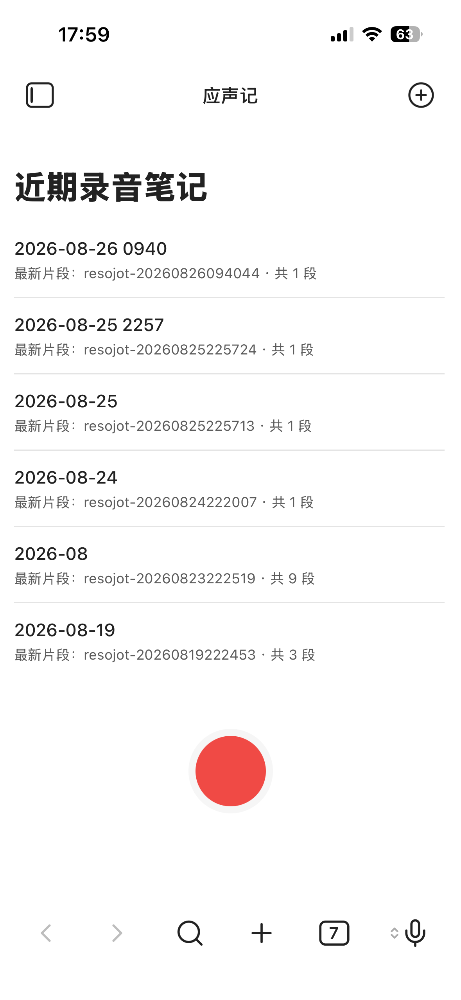
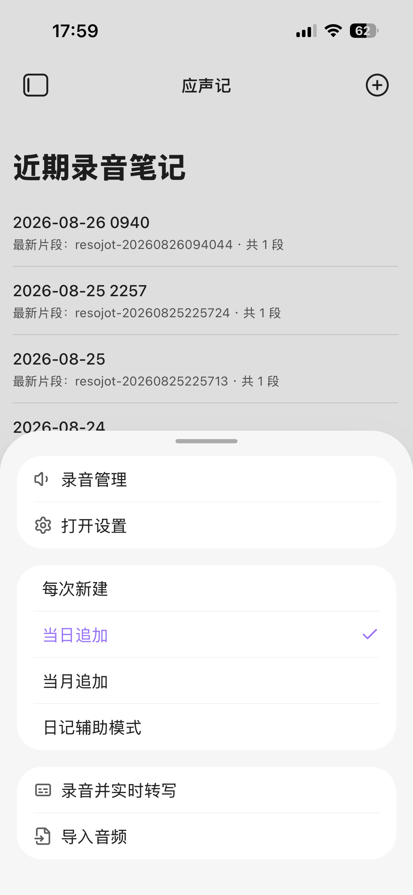
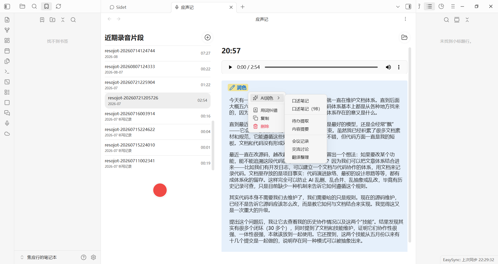
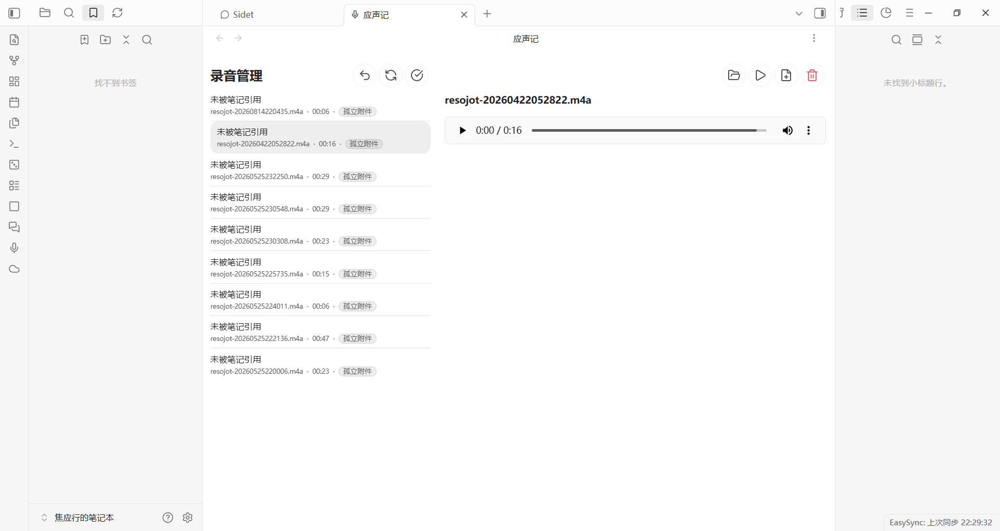
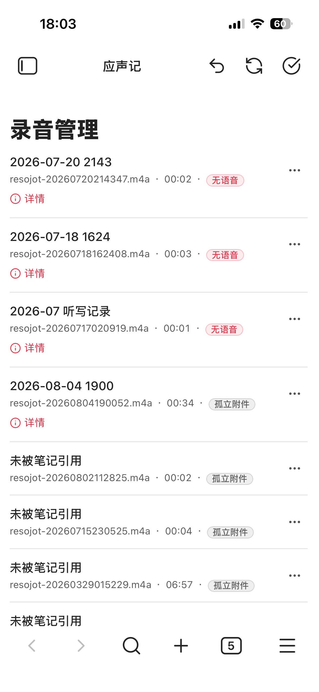
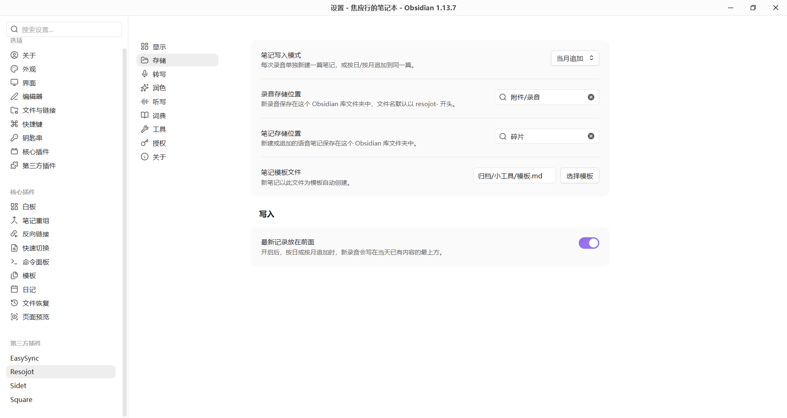
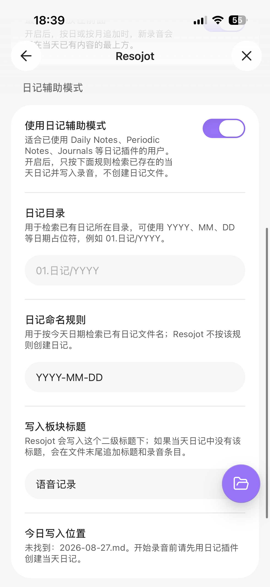
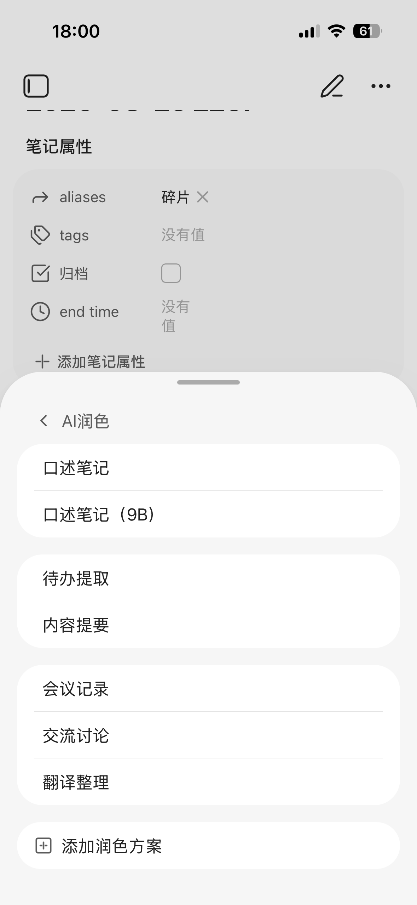
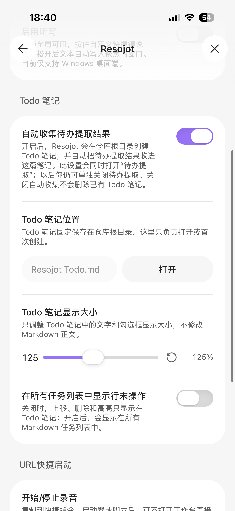
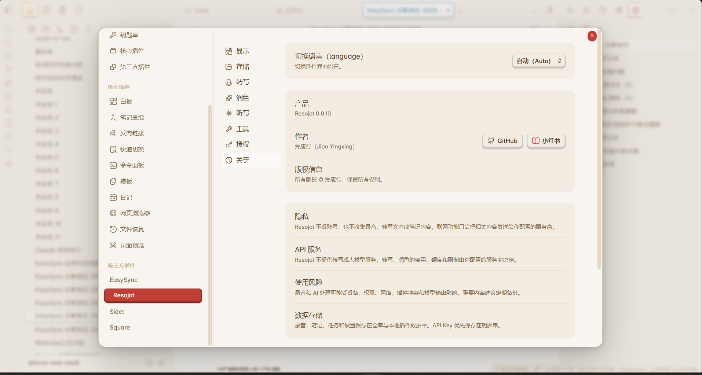

# Resojot

<p align="center">
  <a href="https://github.com/jiaoyingxing/resojot/releases">
    
  </a>
  <a href="https://github.com/jiaoyingxing/resojot/releases">
    
  </a>
  <a href="./README.md">
    
  </a>
  <a href="./README-en.md">
    
  </a>
</p>

<p align="center">
  <strong>Language:</strong> <strong>English</strong> · <a href="./README.md"><strong>简体中文</strong></a>
</p>

Resojot keeps recording, transcription, organization, and Markdown note capture in one Obsidian workflow.

- Save audio automatically and create Markdown notes after recording.
- Transcribe with local or cloud ASR, then use customizable LLM workflows for polish, Todo extraction, or summaries.
- Process imported and long-form audio with recovery and fallback across validated providers.
- iPhone, Android, Windows, and macOS compatibility is maintained continuously.

<p align="center">
  
</p>

## ✨ Main Capabilities

| Category | Description |
|:---|:---|
| Entry points and Workbench | Start from shortcuts, commands, or buttons on desktop; use URL shortcuts for one-tap recording on mobile |
| Audio and notes | Store audio in the Obsidian vault and choose per-recording, daily, monthly, or journal-assist writing, with custom folders, sorting, and templates |
| ASR transcription | Manage multiple local or cloud ASR configurations, validate them before use, and fall back to another qualified provider when a task fails |
| Long audio and recovery | Process long recordings in chunks with visible progress, then recover unfinished work after app shutdowns, mobile interruptions, or network instability |
| LLM organization | Use custom polish profiles, extract Todos, create content summaries, or apply scenario-specific processing |
| Recording management | Review transcription, polish, failures, missing notes, and orphan attachments in one place, with cancellation, retry, note recovery, and staged cleanup |
| Independent processing | Import existing audio, process audio from the current note, or transcribe a completed recording again |
| Interface languages | Simplified Chinese and English interfaces |

## 🎁 Scenarios and Extensions

| Category | Description |
|:---|:---|
| Windows dictation | Hold to speak and release to insert text like a voice input tool; recordings can be retained, and failures remain available in Recording Management |
| Todo notes | Collect extracted Todos automatically, with completion, sorting, move-to-top, native highlight, and delete actions |
| Content summaries | Summarize each recording into one sentence and write it into the file name or note outline |
| Computer audio | Record computer playback, including headphone output, on Windows and macOS 13+; macOS 15+ can also include the microphone |
| Journal assist | Write regular recordings into an existing daily note created by Daily Notes, Periodic Notes, Journals, or a similar tool without taking over journal creation |
| Local transcription service | On desktop, discover and manage a separately installed FunASR program; users still install FunASR and prepare its models themselves |
| Recording display | Choose no extra indicator, a top strip, or a full-screen overlay; regular and computer-audio recording share the same display rule |

## 🖥️ Platforms and Versions

| Capability | Requirement |
|:---|:---|
| Standard Resojot features | Obsidian `1.11.4+`; Windows, macOS, iPhone, and Android |
| Windows dictation | Windows desktop only |
| Computer-audio recording | Windows and macOS 13+ desktop; macOS 15+ can include the microphone |
| Local FunASR management | Desktop, with FunASR and its models installed separately |
| Resojot CLI | Official Obsidian desktop installer `1.12.7+` with Command line interface enabled |

## 🧪 Resojot CLI (Testing feature)

Starting with `0.9.10`, Resojot CLI is available as a testing feature for external agents such as Codex and Claude Code. It can discover plugin capabilities, process existing audio in the vault, query / retry / cancel persistent jobs, and return result notes and artifacts. It can also safely adjust storage settings, audit recording-management state, preview bounded content, and—after the user confirms an exact plan—restore notes, retry jobs, or clean up selected items. Its preflight distinguishes host, vault, plugin, and command readiness, while its feedback route can hand off a fully previewed and user-approved report to GitHub Issues.

- Requires the official Obsidian desktop installer `1.12.7+` with **Settings → General → Command line interface** enabled
- Obsidian and the target vault must stay open while it is used; CLI is unavailable on mobile and older hosts
- Write operations retain the boundary of exact planning, user-facing explanation, confirmation, and pre-apply revalidation
- CLI does not expose API keys, license keys, or internal queues; its public contract and operation scope may still change during testing

Minimal capability discovery:

```shell
obsidian vault="<vault-name-or-id>" resojot
obsidian vault="<vault-name-or-id>" resojot:capabilities
obsidian vault="<vault-name-or-id>" resojot:schema command=resojot:process-audio
```

If the terminal is already inside the target vault, `vault=...` can be omitted. Treat the current `resojot:schema` output as the source of truth for command parameters.

## 👀 UI Preview

| Scenario | Preview |
|:---|:---|
| **Workbench quick menu**<br>Open Recording Management and settings, switch among four writing modes, or import audio directly from the mobile Workbench. |  |
| **Callout action menu**<br>Continue from the current transcript or polish block with polish profiles, Todo extraction, summaries, copy, or delete. |  |
| **Desktop Recording Management**<br>Review failure reasons, retry status, and per-recording details in one place. |  |
| **Mobile Recording Management**<br>Review cancelled, no-speech, missing-note, and orphan-attachment states on mobile. |  |
| **Storage and writing**<br>Choose the writing mode, audio and note folders, templates, and append order. |  |
| **Journal assist mode**<br>Locate an existing journal by folder, date format, and target heading. |  |
| **Polish and add-on processing**<br>Manage polish providers, default polish, Todo extraction, and content summaries. |  |
| **Todo notes**<br>Control automatic collection, note location, display size, and line-end task actions. |  |
| **About and privacy**<br>Review the current version, author links, privacy, API service, usage risks, and data storage information. |  |

## 🔌 Supported Services

| Type | Supported |
|:---|:---|
| Transcription (ASR) | Local Transcription Service (OpenAI-compatible; desktop can manage an installed FunASR setup)<br>Cloud OpenAI-compatible endpoint<br>SiliconFlow<br>Doubao ASR<br>Tencent Cloud ASR<br>Aliyun DashScope ASR<br>Xiaomi MiMo ASR<br>OpenAI<br>Azure Speech<br>Google Speech-to-Text |
| Polish (LLM) | SiliconFlow<br>Doubao<br>Qwen<br>DeepSeek<br>Xiaomi MiMo<br>OpenAI / ChatGPT<br>Gemini<br>Anthropic / Claude<br>Ollama<br>Custom OpenAI-compatible endpoint |

> [!NOTE]
> A Resojot license does not include any third-party cloud service quota. Service availability, model access, costs, and request limits are determined by the provider you configure.

## 🚀 Installation

### Option 1: Obsidian Community Plugins (recommended)

1. Open **Settings → Community plugins** in Obsidian
2. Choose **Browse** and search for **Resojot**
3. Install and enable the plugin

### Option 2: BRAT

1. Install **BRAT** from Obsidian Community Plugins
2. Open BRAT and choose **Add Beta plugin**
3. Enter `https://github.com/jiaoyingxing/resojot`
4. After installation, enable **Resojot** in Obsidian settings

> BRAT can update the plugin directly from GitHub Releases, so you usually do not need to replace files manually.

### Option 3: Manual installation

1. Download `main.js`, `manifest.json`, and `styles.css` from [GitHub Releases](https://github.com/jiaoyingxing/resojot/releases)
2. Put them into `.obsidian/plugins/resojot/` inside your vault
3. Restart Obsidian, or reload community plugins
4. Enable Resojot in Obsidian settings

## 🔐 License and Privacy

### License status

| Status | Available features |
|:---|:---|
| 🔒 Unlicensed | Recording, audio saving, basic Markdown notes, and basic templates |
| 🔓 Licensed | Automatic transcription, including its task queue and retry flow; imported-audio transcription; AI polish; and polish-dependent Todo extraction and content summaries |

- License keys are verified locally through signature validation
- License keys do not include any third-party cloud service quota
- License duration and supported versions are shown in the plugin's License details
- To get a license key, search Xiaohongshu for **焦应行**

### Data and storage

| Data | Stored in |
|:---|:---|
| 🎙️ Audio files and Markdown notes | Your Obsidian vault (local) |
| ⚙️ Plugin settings, license state, and pending task state | Local Obsidian plugin data |
| 🔑 Provider API keys, polish API keys, and license key | Obsidian SecretStorage, separated by device and vault |

- Resojot does not include client-side telemetry
- If you enable cloud transcription or cloud polish, the processed audio or text will be sent to your configured provider

> [!CAUTION]
> Do not publish `.obsidian/plugins/resojot/data.json`. It may contain settings, queue state, license state, and legacy provider credentials from older versions.

## 👋 Contact and Feedback

- Bugs, reproducible issues, and feature requests: [GitHub Issues](https://github.com/jiaoyingxing/resojot/issues)
- Usage questions, license access, and product discussion: search Xiaohongshu for **焦应行**
- Detailed setup guides, free API guides, plugin tips, and support-group information are also available on Xiaohongshu

## 📜 License

- Distributed as a closed-source plugin
- Installation and updates are available through Obsidian Community Plugins, BRAT, or GitHub Releases
- See [LICENSE](./LICENSE)
