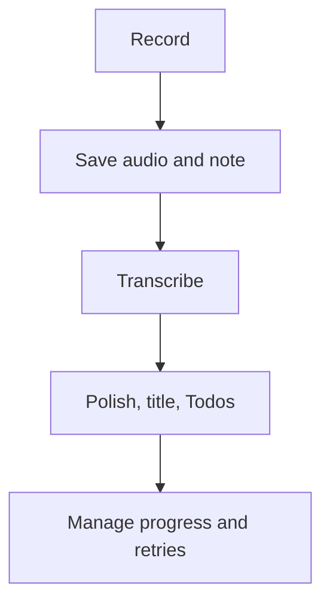

# Resojot

<p align="center">
  <a href="https://github.com/jiaoyingxing/resojot/releases">
    
  </a>
  <a href="https://github.com/jiaoyingxing/resojot/releases">
    
  </a>
  <a href="./README.md">
    
  </a>
  <a href="./README-en.md">
    
  </a>
</p>

<p align="center">
  <strong>Language:</strong> <strong>English</strong> · <a href="./README.md"><strong>简体中文</strong></a>
</p>

Resojot helps you record, transcribe, and organize audio in Obsidian, so spoken content becomes searchable, usable notes faster.

## 👋 Contact

- For a license key, usage questions, or product discussion, search Xiaohongshu for **焦应行**
- Setup guides, free API guides, and plugin usage knowledge base: [Resojot 应声记](https://my.feishu.cn/wiki/WvpJwybn6iOJXUkCiODcs1d0nIe)
- Bugs, reproducible issues, and feature requests: [GitHub Issues](https://github.com/jiaoyingxing/resojot/issues)

## 1. ⚙️ Automated Workflow


```mermaid
flowchart TB
    A["Record"]
    B["Save audio and note"]
    C["Transcribe"]
    D["Polish, title, Todos"]
    E["Manage progress and retries"]
    A --> B --> C --> D --> E
```

From saving recordings to transcription, polish, titles, Todos, and summaries, Resojot can run the workflow automatically based on your settings; tasks wait when a required service is not configured yet, then continue once configuration is completed.

<p align="center">
  
</p>

## 2. ✨ Main Capabilities

| Category | Description |
|:---|:---|
| Quick recording | Start recording from the bottom of the Workbench. Desktop also supports shortcuts, commands, and buttons; mobile supports URL shortcuts. |
| Structured notes | Audio, transcripts, polished text, Todos, and summaries are written into Markdown notes, separated by content type for review and follow-up actions. |
| Automatic structured storage | After recording, audio and notes are saved based on your settings. Audio and note locations, file naming, note templates, and append order can be configured separately, with per-recording, daily, monthly, and journal-assist writing. |
| Automatic transcription | After local or cloud ASR is configured, recordings enter transcription automatically. You can save multiple service configurations, and Resojot can try another eligible service when the current one fails. |
| Live transcription while recording | From the Workbench, use “Record and transcribe live” to show transcript sentences while recording; after stopping, Resojot still saves the complete audio and continues through full transcription and polish based on your settings. |
| Automatic AI polish | After automatic polish is enabled, finished transcripts continue into spoken-language cleanup and formatting. You can also apply custom polish actions to the current text. |
| Automatic titles and Todos | Generate titles or one-sentence summaries from recording content, write them into filenames or note outlines, and collect extracted Todos into a Todo note automatically. |
| Long audio and recovery | Process long recordings in chunks with visible progress. Unfinished work remains available after app shutdowns, mobile interruptions, or network instability, and can continue after reopening. |
| Visual management | The Workbench shows recent recording notes; Recording Management shows transcription, polish, failures, missing notes, and orphan attachments, with cancel, retry, note recovery, and staged cleanup actions. |
| Existing audio | Import external audio, process audio in the current note, or transcribe completed results again. |
| Tablet and multi-window layout | Phones keep a single-column flow; tablets and desktop windows adapt Settings and Workbench layouts to the available width. |
| Interface and devices | Simplified Chinese and English interfaces; standard features support Windows, macOS, iPhone, and Android. |

Transcript and polish results are written into callouts in the note. Open the action menu on the current callout to retranscribe, choose a polish profile, extract Todos, generate a summary, copy, or delete.

## 3. 🎁 Scenarios and Extensions

| Category | Description |
|:---|:---|
| Windows dictation | Hold to speak and release to insert text like a voice input tool; recordings can be retained, and failures remain available in Recording Management |
| Computer audio | Record computer playback, including headphone output, on Windows and macOS 13+; macOS 15+ can also include the microphone |
| Journal assist | Write regular recordings into an existing daily note created by Daily Notes, Periodic Notes, Journals, or a similar tool without taking over journal creation |
| Local transcription service | On desktop, discover, choose, start, and stop a separately installed FunASR program; users still install FunASR, Python, and models themselves |
| Recording display | Choose no extra indicator, a top strip, or a full-screen overlay; regular and computer-audio recording share the same display rule |

## 4. 🖥️ Platforms and Versions

| Capability | Requirement |
|:---|:---|
| Standard Resojot features | Obsidian `1.11.4+`; Windows, macOS, iPhone, and Android |
| Tablet and multi-window layout | Wide tablets and desktop windows adapt the Workbench and Settings layouts to the available width |
| Windows dictation | Windows desktop only |
| Computer-audio recording | Windows and macOS 13+ desktop; macOS 15+ can include the microphone |
| Local FunASR management | Desktop, with FunASR and its models installed separately |
| Resojot CLI | Official Obsidian desktop installer `1.12.7+` with Command line interface enabled |

## 5. 🧪 Resojot CLI (Testing feature)

Starting with `0.9.10`, Codex, Claude Code, and other external agents can call Resojot through the official Obsidian CLI. This feature is currently in testing.

An agent can check the current environment and plugin capabilities, process existing audio in the vault, query, retry, or cancel jobs, and retrieve result notes and artifacts. It can also read storage and polish settings, inspect FunASR status, audit the Recording Management list, and preview a bounded segment from a selected recording.

Before changing settings, restoring notes, retrying tasks, or cleaning up items, Resojot generates an exact plan. The agent needs to explain the plan and impact to the user and submit it only after confirmation; before execution, Resojot checks again whether the target objects or settings have changed.

- Requires the official Obsidian desktop installer `1.12.7+` with **Settings → General → Command line interface** enabled
- Obsidian and the target vault must stay open while it is used; CLI is unavailable on mobile and older hosts
- Previewing a recording without an existing transcript may send the selected segment to the current transcription service and may incur service costs
- CLI does not expose API keys, license keys, or internal queues; its public contract and operation scope may still change during testing

Minimal capability discovery:

```shell
obsidian vault="<vault-name-or-id>" resojot
obsidian vault="<vault-name-or-id>" resojot:capabilities
obsidian vault="<vault-name-or-id>" resojot:schema command=resojot:process-audio
```

If the terminal is already inside the target vault, `vault=...` can be omitted. Treat the current `resojot:schema` output as the source of truth for command parameters.

## 6. 👀 Selected Interface Previews

> The features shown in the desktop screenshots below are also available on mobile. Resojot adapts the layout to the screen.

### 6.1 Desktop Screenshots

**Callout action menu**<br>
Continue from the current transcript or polish block with polish profiles, Todo extraction, summaries, copy, or delete.

<p align="center">
  
</p>

**Storage and writing**<br>
Choose the writing mode, audio and note folders, templates, and append order.

<p align="center">
  
</p>

**Desktop Recording Management**<br>
Review failure reasons, retry status, and per-recording details in one place.

<p align="center">
  
</p>

**About and privacy**<br>
Review the current version, author links, privacy, API service, usage risks, and data storage information.

<p align="center">
  
</p>

### 6.2 Mobile Screenshots

| Scenario | Preview |
|:---|:---|
| **Mobile Workbench**<br>Review recent recording notes and start recording from the button at the bottom. |  |
| **Workbench quick menu**<br>Open Recording Management and settings, switch among four writing modes, or import audio directly from the mobile Workbench. |  |
| **Journal assist mode**<br>Locate an existing journal by folder, date format, and target heading. |  |
| **Polish and add-on processing**<br>Manage polish providers, default polish, Todo extraction, and content summaries. |  |
| **Todo notes**<br>Control automatic collection, note location, display size, and line-end task actions. |  |
| **Mobile Recording Management**<br>Review cancelled, no-speech, missing-note, and orphan-attachment states on mobile. |  |

## 7. 🔌 Supported Services

| Type | Supported |
|:---|:---|
| Transcription (ASR) | Local Transcription Service (OpenAI-compatible; desktop can manage an installed FunASR setup)<br>Cloud OpenAI-compatible endpoint<br>SiliconFlow<br>Doubao ASR<br>Tencent Cloud ASR<br>Aliyun DashScope ASR<br>Xiaomi MiMo ASR<br>OpenAI<br>Azure Speech<br>Google Speech-to-Text |
| Polish (LLM) | SiliconFlow<br>Doubao<br>Qwen<br>DeepSeek<br>Xiaomi MiMo<br>OpenAI / ChatGPT<br>Gemini<br>Anthropic / Claude<br>Ollama<br>Custom OpenAI-compatible endpoint |

> [!NOTE]
> A Resojot license does not include any third-party cloud service quota. Service availability, model access, costs, and request limits are determined by the provider you configure.

## 8. 🚀 Installation

### 8.1 Obsidian Community Plugins (recommended)

1. Open **Settings → Community plugins** in Obsidian
2. Choose **Browse** and search for **Resojot**
3. Install and enable the plugin

### 8.2 BRAT

1. Install **BRAT** from Obsidian Community Plugins
2. Open BRAT and choose **Add Beta plugin**
3. Enter `https://github.com/jiaoyingxing/resojot`
4. After installation, enable **Resojot** in Obsidian settings

> BRAT can update the plugin directly from GitHub Releases, so you usually do not need to replace files manually.

### 8.3 Manual installation

1. Download `main.js`, `manifest.json`, and `styles.css` from [GitHub Releases](https://github.com/jiaoyingxing/resojot/releases)
2. Put them into `.obsidian/plugins/resojot/` inside your vault
3. Restart Obsidian, or reload community plugins
4. Enable Resojot in Obsidian settings

## 9. 🔐 License and Privacy

### 9.1 License status

| Status | Available features |
|:---|:---|
| 🔒 Unlicensed | Recording, audio saving, basic Markdown notes, and basic templates |
| 🔓 Licensed | Automatic transcription, including its task queue and retry flow; imported-audio transcription; AI polish; and polish-dependent Todo extraction and content summaries |

- License keys are verified locally through signature validation
- License keys do not include any third-party cloud service quota
- License duration and supported versions are shown in the plugin's License details
- To get a license key, search Xiaohongshu for **焦应行**

### 9.2 Data and storage

| Data | Stored in |
|:---|:---|
| 🎙️ Audio files and Markdown notes | Your Obsidian vault (local) |
| ⚙️ Plugin settings, license state, and pending task state | Local Obsidian plugin data |
| 🔑 Provider API keys, polish API keys, and license key | Obsidian SecretStorage, separated by device and vault |

- Resojot does not include client-side telemetry
- If you enable cloud transcription or cloud polish, the processed audio or text will be sent to your configured provider

> [!CAUTION]
> Do not publish `.obsidian/plugins/resojot/data.json`. It may contain settings, queue state, license state, and legacy provider credentials from older versions.

## 10. 📜 License

- Distributed as a closed-source plugin
- Installation and updates are available through Obsidian Community Plugins, BRAT, or GitHub Releases
- See [LICENSE](./LICENSE)
