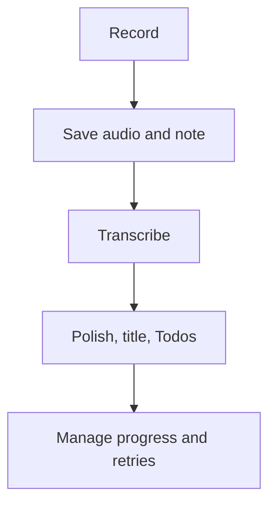
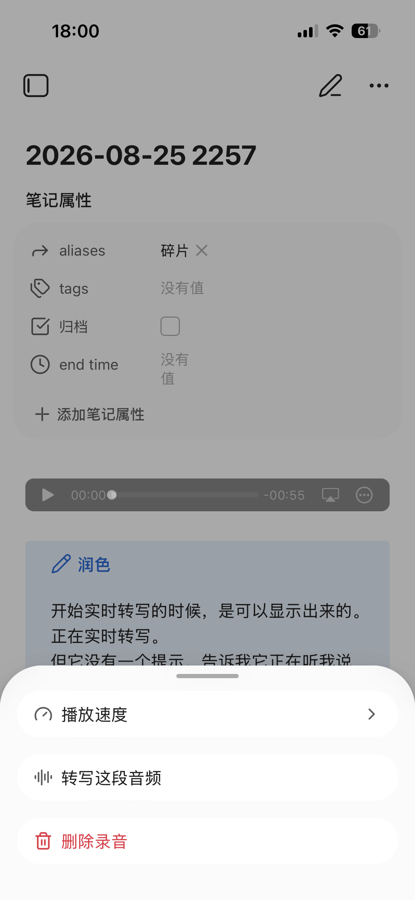

# Resojot

<p align="center">
  <a href="https://github.com/jiaoyingxing/resojot/releases">
    
  </a>
  <a href="https://github.com/jiaoyingxing/resojot/releases">
    
  </a>
  <a href="./README.md">
    
  </a>
  <a href="./README-en.md">
    
  </a>
</p>

Resojot helps you record, transcribe, and organize audio in Obsidian, so spoken content becomes searchable, usable notes faster.

## 1. ⚙️ Overview

<p align="center">
  
</p>


```mermaid
flowchart TB
    A["Record"]
    B["Save audio and note"]
    C["Transcribe"]
    D["Polish, title, Todos"]
    E["Manage progress and retries"]
    A --> B --> C --> D --> E
```

## 2. ✨ Core Capabilities

Features marked 🔒 require a license key; everything else is available right after installation.

| Capability | Description |
|:---|:---|
| Built-in recording | Record right inside Obsidian: start with one click from the Workbench, use shortcuts and commands on desktop, or URL shortcuts on mobile. Recording data is protected by a local cache — if saving fails nothing is lost, and it is restored automatically after the plugin restarts. |
| Automatic note library storage | When a recording ends, the audio is saved automatically and a Markdown note is created: transcript, polished text, Todos, and summaries are written into the same note in separate sections. Where recordings go, how they are named, and which template is used are all configurable. |
| Automatic transcription | Once a transcription service is configured, recordings turn into text automatically. Words that often come out wrong can be added to a local dictionary and are corrected automatically afterwards; the dictionary can be exported and migrated between devices. When one service fails, Resojot automatically tries the next eligible one. |
| Live transcription 🔒 | Choose “Record and transcribe live” from the Workbench and sentences appear while you speak; after stopping, the complete audio is still saved and follow-up processing continues. |
| Long-recording transcription 🔒 | Recordings beyond 5 minutes are transcribed in segments with visible progress; unfinished parts resume after the app reopens. |
| AI polish and organization | Finished transcripts are automatically cleaned up into readable notes, with optional titles and one-sentence summaries; extracted Todos are collected into a Todo note 🔒 automatically. You can also polish manually, extract Todos, or correct wording from a note at any time. |
| Recording Management | The Workbench shows recent recording notes; the management view shows the state of each recording in one place — retry failures, recover missing notes, and clean up orphan attachments. |

## 3. 🚀 Quick Start

**Installation** (choose one):

1. **Obsidian Community Plugins (recommended)**: Settings → Community plugins → Browse → search **Resojot**, then install and enable
2. **BRAT**: install BRAT, choose **Add Beta plugin**, and enter `https://github.com/jiaoyingxing/resojot`; it then updates automatically from GitHub Releases
3. **Manual**: download `main.js`, `manifest.json`, and `styles.css` from [GitHub Releases](https://github.com/jiaoyingxing/resojot/releases), put them into `.obsidian/plugins/resojot/` in your vault, reload community plugins, and enable Resojot

**First use**:

1. Choose a transcription service in the plugin settings; the [setup guides and free API guides](https://my.feishu.cn/wiki/WvpJwybn6iOJXUkCiODcs1d0nIe) in the knowledge base can help
2. Start your first recording from the button at the bottom of the Workbench; after saving, transcription and polish run automatically based on your settings

Without a license key you can still use recording, notes, and transcription and polish for recordings up to 5 minutes; see License and Privacy below for the full boundary.

## 4. 🔌 Supported Services

| Type | Supported |
|:---|:---|
| Transcription (ASR) | Local Transcription Service (OpenAI-compatible; Windows desktop can install or manage a FunASR setup)<br>Cloud OpenAI-compatible endpoint<br>SiliconFlow<br>Doubao ASR<br>Tencent Cloud ASR<br>Aliyun DashScope ASR<br>Xiaomi MiMo ASR<br>OpenAI<br>Azure Speech<br>Google Speech-to-Text<br>Google Gemini |
| Polish (LLM) | SiliconFlow<br>Doubao<br>Qwen<br>DeepSeek<br>Xiaomi MiMo<br>OpenAI / ChatGPT<br>Gemini<br>Anthropic / Claude<br>Ollama<br>Custom OpenAI-compatible endpoint |

> [!NOTE]
> A Resojot license does not include any third-party cloud service quota. Service availability, model access, costs, and request limits are determined by the provider you configure.

## 5. 🎁 Advanced and Desktop Capabilities

Features marked 🔒 require a license key; everything else is available right after installation.

| Capability | Description |
|:---|:---|
| Local transcription | On Windows desktop, install FunASR with one click and its runtime environment is prepared automatically; you can also use an already-installed FunASR. Models are downloaded on demand on first use. |
| Journal assist | Write recordings into the current day's note already created by Daily Notes, Periodic Notes, Journals, or similar tools. Resojot finds the note and writes into it; it does not take over journal creation. |
| Recording display | The recording indicator floats globally, so you can keep taking notes while recording: choose a top strip, a full-screen overlay, or no indicator. Regular and computer-audio recording share the same display settings. |
| Windows dictation 🔒 | On Windows, hold a hotkey to speak and release to insert the text into the current app. Recordings can be retained per settings; failed entries return to Recording Management. |
| Computer audio 🔒 | Record the sound your computer is playing, including through headphones; on macOS 15+ the microphone can be recorded at the same time. |
| Speaker labeling 🔒 | After transcription, Resojot distinguishes speakers and writes the text back with per-sentence “Speaker N:” prefixes. Before first use, get the recognition components from the Tools page in settings (about 38 MB, once per vault); recordings over 1 hour are not supported yet. |
| Existing audio 🔒 | Import external audio, process audio in the current note, or re-transcribe completed results. |

## 6. 🖥️ Platforms and Versions

| Capability | Requirement |
|:---|:---|
| Standard Resojot features | Obsidian `1.11.4+`; Windows, macOS, iPhone, and Android; Simplified Chinese and English interfaces |
| Multi-device layout | Phones, tablets, and computers each get a purpose-designed interface; on tablets and desktop multi-window, the Workbench and Settings adjust to the window width |
| Windows dictation | Windows desktop only |
| Computer-audio recording | Windows and macOS 13+ desktop; macOS 15+ can include the microphone |
| Local FunASR management | Desktop; Windows can install FunASR with one click, including its runtime environment, or manage an installed FunASR |
| Resojot CLI | Official Obsidian desktop installer `1.12.7+` with Command line interface enabled |

## 7. 👀 Selected Interface Previews

> The features shown in the desktop screenshots below are also available on mobile. Resojot adapts the layout to the screen.

### 7.1 Desktop Screenshots

**Transcript and polish actions**<br>
Open “AI polish,” or use “Correct wording,” copy, and delete.

<p align="center">
  
</p>

**Storage and writing**<br>
Choose the writing mode, audio and note folders, templates, and append order.

<p align="center">
  
</p>

**Desktop Recording Management**<br>
Review failure reasons, retry status, and per-recording details in one place.

<p align="center">
  
</p>

### 7.2 Mobile Screenshots

| Scenario | Preview |
|:---|:---|
| **Mobile Workbench**<br>Review recent recording notes and start recording from the button at the bottom. |  |
| **Workbench quick menu**<br>Open Recording Management and settings, switch among four writing modes, or import audio directly from the mobile Workbench. |  |
| **Journal assist mode**<br>Locate an existing journal by folder, date format, and target heading. |  |
| **AI polish and add-on processing**<br>Open “AI polish” from a note's content action menu to apply or create polish profiles, extract Todos, or generate summaries. |  |
| **Todo notes**<br>Control automatic collection, note location, display size, and line-end task actions. |  |
| **Audio bar menu**<br>Adjust playback speed, transcribe this audio, or delete the recording; the audio file is kept while the note still references it. |  |
| **Mobile Recording Management**<br>Review cancelled, no-speech, missing-note, and orphan-attachment states on mobile. |  |

## 8. 🧪 Resojot CLI (Testing feature)

Codex, Claude Code, and other external agents can call Resojot through the official Obsidian CLI. An agent can check the current environment and plugin capabilities, start or stop recordings, process existing audio in the vault, query, retry, or cancel jobs, and retrieve result notes and artifacts. It can also read storage and polish settings, inspect FunASR status, read and update the terminology dictionary, audit the Recording Management list, and preview a bounded segment from a selected recording.

Before changing settings, restoring notes, retrying tasks, or cleaning up items, Resojot generates an exact plan. The agent needs to explain the plan and impact to the user and submit it only after confirmation; before execution, Resojot checks again whether the target objects or settings have changed.

- Requires the official Obsidian desktop installer `1.12.7+` with **Settings → General → Command line interface** enabled; Obsidian and the target vault must stay open while it is used, and CLI is unavailable on mobile
- Previewing a recording without an existing transcript may send the selected segment to the current transcription service and may incur service costs
- CLI does not expose API keys, license keys, or internal queues; its public contract and operation scope may still change during testing

Minimal capability discovery:

```shell
obsidian vault="<vault-name-or-id>" resojot
obsidian vault="<vault-name-or-id>" resojot:capabilities
obsidian vault="<vault-name-or-id>" resojot:schema command=resojot:process-audio
```

If the terminal is already inside the target vault, `vault=...` can be omitted. Treat the current `resojot:schema` output as the source of truth for command parameters.

## 9. 🔐 License and Privacy

### 9.1 License status

| Status | Available features |
|:---|:---|
| 🔓 Free | Recording, audio saving, basic Markdown notes and templates; transcription of recordings up to 5 minutes with automatic polish and title generation; manual polish and todo extraction on existing transcripts; using existing polish profiles |
| 🔒 License required | Transcribing recordings beyond 5 minutes, imported-audio transcription, computer-audio recording, desktop dictation, real-time transcription, Todo collection, speaker labeling, and managing polish profiles |

- To get a license key, search Xiaohongshu for **焦应行** 🔍
- License keys are verified locally through signature validation; license duration and supported versions are shown in the plugin's License details

### 9.2 Data and storage

| Data | Stored in |
|:---|:---|
| 🎙️ Audio files and Markdown notes | Your Obsidian vault (local) |
| ⚙️ Plugin settings, dictionary, license state, and pending task state | Local Obsidian plugin data |
| 🔑 Provider API keys, polish API keys, and license key | Obsidian SecretStorage, separated by device and vault |

- Resojot does not include client-side telemetry
- If you enable cloud transcription or cloud polish, the processed audio or text will be sent to your configured provider
- An exported dictionary Markdown file is a plain-text transfer file that may be read by sync, backup, or search tools; import requires confirmation and never silently replaces the active dictionary

> [!CAUTION]
> Do not publish `.obsidian/plugins/resojot/data.json`. It may contain settings, queue state, license state, and legacy provider credentials from older versions.

## 10. 💬 Feedback and Support

- Setup guides, free API guides, and usage tips: [Resojot 应声记 knowledge base](https://my.feishu.cn/wiki/WvpJwybn6iOJXUkCiODcs1d0nIe)
- Bugs, reproducible issues, and feature requests: [GitHub Issues](https://github.com/jiaoyingxing/resojot/issues)
- Community and product updates: search Xiaohongshu for **焦应行** 🔍

## 11. 📜 License

- Distributed as a closed-source plugin
- Speaker recognition runs on [onnxruntime-web](https://github.com/microsoft/onnxruntime) (MIT License); recognition models come from each publisher's public release, and their licenses and terms follow the publisher's documentation
- Installation and updates are available through Obsidian Community Plugins, BRAT, or GitHub Releases
- See [LICENSE](./LICENSE)
