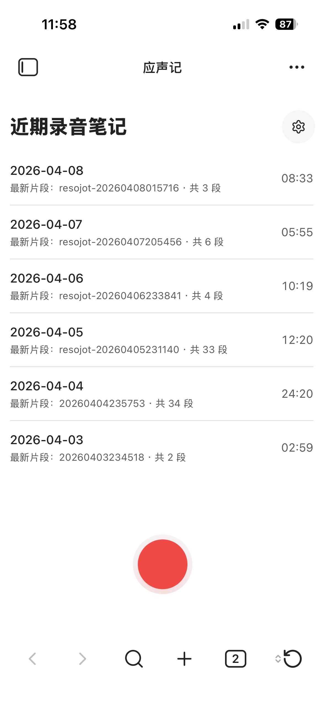
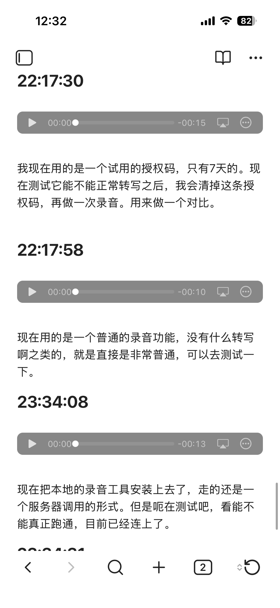

# Resojot / 应声记

**Resojot** is an Obsidian voice notes plugin focused on fast capture, structured note writing, and flexible transcription backends.

**应声记（Resojot）** 是一个面向 Obsidian 的语音笔记插件，重点在于：快速录音、稳定写入笔记，以及更自由的转写后端选择。

---

## Overview / 项目简介

Resojot is designed for people who want to record first and organize later.

Instead of treating voice capture as a separate workflow, Resojot tries to make recording, note writing, pending transcription, and later processing feel like one continuous path inside Obsidian.

Resojot 面向的是“先记录，再整理”的使用方式。

它不是把录音当成一个独立流程，而是希望把**录音、写入笔记、待转处理、后续整理**收成一条在 Obsidian 内连续完成的工作流。

  
  
  

 

---

## Current Focus / 当前方向

The current project is focused on three core surfaces:

1. **Workbench view**
2. **Pending center**
3. **Plugin settings**

当前插件目前聚焦在三个核心界面：

1. **工作台**
2. **待转中心**
3. **插件设置**

The goal is to keep the product focused, instead of turning it into a heavy all-in-one recording app.

当前目标是保持产品边界清楚，而不是把它做成一个过重的“大而全录音软件”。

---

## Current Status / 当前状态

The current MVP already includes:

- direct recording from command or workbench
- audio save and note write flow
- `daily` append as the default record mode
- template support
- pending transcription queue and retry flow
- zh-CN / en / auto UI language support
- mobile-compatible recording flow
- multiple transcription provider support in progress
- local offline transcription route already validated

当前 MVP 已经具备：

- 从命令或工作台直接开始录音
- 音频保存与笔记写入主链路
- 默认以 `daily` 追加模式记录
- 模板支持
- 待转队列与重试流程
- 简体中文 / 英文 / 自动界面语言支持
- 移动端兼容录音流程
- 多转写 provider 架构已落地
- 本地离线转写路线已完成首轮验证

---

## What Resojot Tries to Solve / Resojot 试图解决什么问题

### English
Many note tools can record audio, but the experience often breaks into pieces:

- recording is separate from note writing
- transcription failures are hard to recover
- local and cloud transcription options are fragmented
- importing existing audio is awkward

Resojot tries to make these parts work together more naturally.

### 中文
很多笔记工具虽然能录音，但体验常常是割裂的：

- 录音和写笔记是分开的
- 转写失败后不容易恢复
- 本地转写与云端转写方案很分散
- 导入已有音频也不顺手

Resojot 想做的是，把这些环节更自然地接起来。

---

## Main Capabilities / 当前主要能力

### Recording / 录音
- start recording directly inside Obsidian
- save audio into the vault
- write note content automatically

- 在 Obsidian 内直接开始录音
- 音频保存到库内
- 自动写入对应笔记内容

### Transcription / 转写
- queue-based transcription flow
- retry and pending recovery
- multiple provider architecture
- support for local offline provider route

- 基于队列的转写流程
- 支持重试与待转恢复
- 已建立多 provider 架构
- 支持本地离线路线接入

### Note Workflow / 笔记工作流
- `daily` append workflow
- template-based note generation
- import existing audio for transcription

- 支持 `daily` 追加工作流
- 支持模板生成笔记
- 支持导入已有音频进行识别

---

## Product Direction / 产品方向

Resojot is being built as:

**a voice note workflow plugin with flexible transcription backends**

not as:

**a professional recording studio inside Obsidian**

Resojot 的产品方向是：

**语音笔记工作流插件 + 可插拔转写后端**

而不是：

**在 Obsidian 里塞进一个专业录音软件**

That means the project will continue to prioritize:

- stable recording and note writing
- provider flexibility
- offline transcription options
- clear recovery path for failed tasks

这意味着项目会持续优先关注：

- 稳定的录音与写入主链路
- 更自由的 provider 选择
- 离线转写可行性
- 转写失败后的清晰恢复路径

---

## In Progress / 正在推进

Current ongoing directions include:

- more cloud transcription providers
- stronger local provider workflow
- import audio workflow refinement
- clearer provider capability boundaries
- release preparation and public-facing polish

当前正在推进的方向包括：

- 更多云端转写 provider
- 更稳的本地 provider 工作流
- 导入音频流程继续收口
- 更清楚的 provider 能力边界
- 面向公开发布的整理与打磨

---

## Notes / 说明

This repository is intended to serve as the public-facing project page for Resojot.

这个仓库主要用于作为 Resojot 的对外项目主页。

---

## Roadmap / 路线图

Planned directions include:

- more provider integrations
- better local offline transcription UX
- improved import audio flow
- optional streaming-related exploration later
- more polished release preparation

后续计划方向包括：

- 接入更多 provider
- 优化本地离线转写体验
- 继续完善导入音频流程
- 后续再评估流式转写相关能力
- 完成更正式的发布准备

---

## Contact / 联系方式

欢迎反馈与交流。

- 📕REDnote：1167756159
