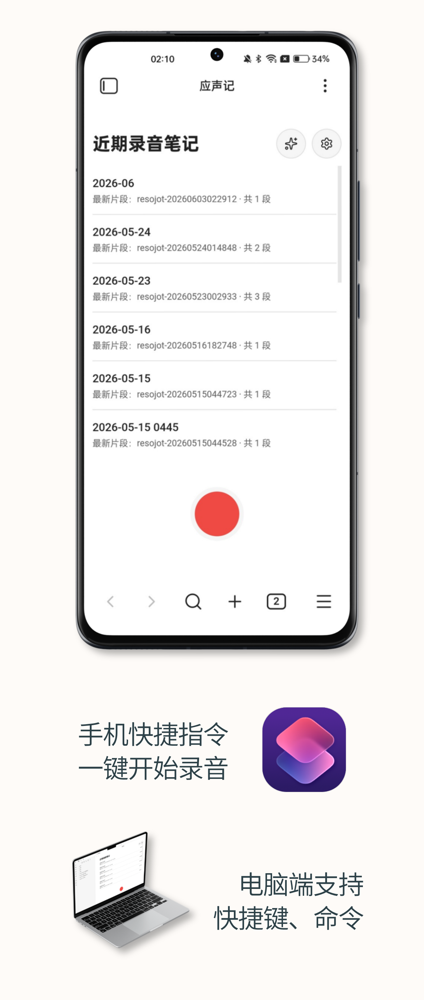
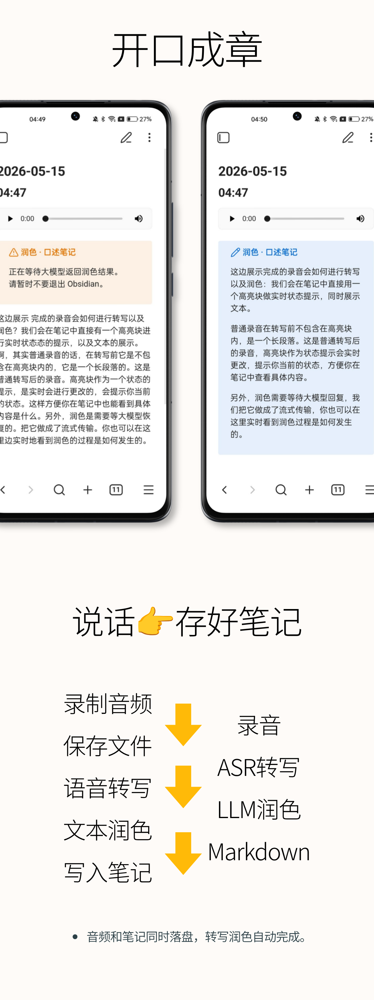
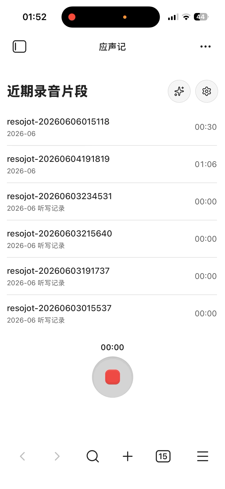
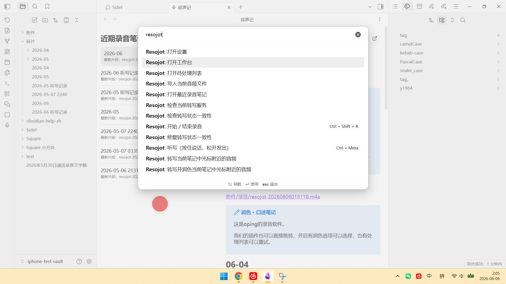
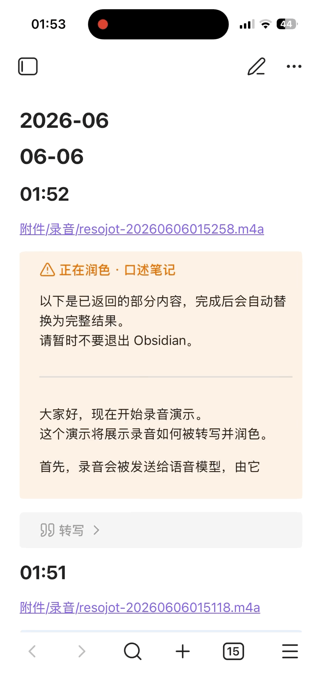
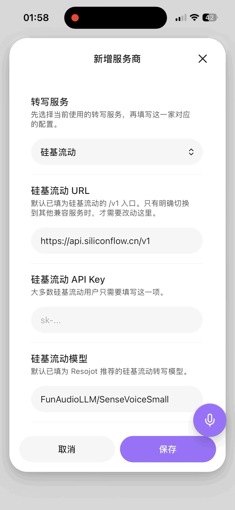

# Resojot 应声记

  <strong>阅读语言：</strong> <strong>简体中文</strong> · <a href="./README-en.md"><strong>English</strong></a>

Obsidian 的语音记录插件。

- 录音、自动保存音频、生成 Markdown 笔记。
- 自动 ASR 转写、LLM 润色，整条链路都在 Obsidian 里完成。
- 每个版本都经过 iPhone、安卓、Windows 实机测试。
- 移动端启动速度占用约为 40~100ms，极低。

## 👋 联系

- 来小红书找我，获取永久授权码。
- 咨询/反馈/授权码获取：小红书搜索 **焦应行** 🔍
- 详细的部署指南、免费API指南、插件使用技巧、售后群，都在小红书。

  

## ✨ 基本能力

| 类别 | 说明 |
|:---|:---|
| 启动入口 | PC 可通过快捷键、命令、按钮启动；移动端可通过 URL 快捷指令一键录音 |
| UI界面 | 如同给Ob里塞了一个录音软件，可视化界面管理，新手友好 |
| 音频保存 | 音频保存至 Obsidian vault，支持按次 / 日 / 月保存，可设目录与排序 |
| Markdown 笔记 | 录音同时生成 Markdown 笔记，包含录音链接、结构化目录与自设笔记模板 |
| ASR 转写 | 多家 ASR 统一接入，支持切换与扩展；API 由用户自配，插件不含服务额度 |
| LLM 润色 | 对转写结果进行 LLM 润色，提示词方案可自定义并随时切换 |
| 队列与管理 | 具备待处理队列、失败重试、录音管理等能力 |
| 独立调用 | 每个功能都可拆分独立调用，也支持导入音频处理 |
| 使用状态 | 已有数百位真实付费用户，持续更新中... |
| i18n | 完整且全面的英文支持;Complete and comprehensive English interface support |

## 🎁 拓展能力

| 类别 | 说明 |
|:---|:---|
| 听写 | 类似Typeless，作语音输入法使用，优势是录音可保存兜底，不怕丢失（暂支持Windows） |
| Todo | 自动提取录音中的待办任务，汇集到同一篇md笔记。勾选使用体验类似iphone备忘录 |
| 提要 | 自动总结每段录音内容，提要成一句话，写入文件名称或大纲 |
| 内部录音 | 录制电脑内部声卡声音，支持戴耳机录制，适用于录制网课、播客等（暂支持Windows） |
| 导入处理 | 一键打开文件管理器，选定音频，即可导入。自动进行转写润色以及其他预设方案处理 |
| 可选润色 | 会议、学习、翻译等场景方案预设，支持自定义方案一键调用 |

  

## 👀 界面预览

| 场景 | 预览 |
|:---|:---|
| **移动端录音工作台** 直接开始录音，查看近期录音片段。 |  |
| **电脑端命令入口** 通过命令面板快速打开工作台、待处理列表和录音命令。 |  |
| **笔记内实时润色** 润色过程中先返回部分内容，完成后自动替换为完整结果。 |  |
| **转写服务商配置** 按服务商与模型维护转写配置，保存后即可切换使用。 |  |

## 🔌 目前接入的服务

| 类型 | 已支持 |
|:---|:---|
| 转写（ASR） | 本地 OpenAI-compatible 接口（支持 voxbox 本地部署模型） 云端 OpenAI-compatible 接口 硅基流动 豆包 ASR 腾讯云 ASR 阿里云 DashScope ASR OpenAI Azure Speech Google Speech-to-Text |
| 润色（LLM） | OpenAI-compatible Anthropic Gemini Ollama |

> [!NOTE]
> 插件授权不包含第三方云服务额度。

## 🚀 安装

> [!WARNING]
> Resojot 为闭源插件，官方插件商店搜不到。

### 方式一：**BRAT（推荐）**，我已汉化了BRAT并被作者合并大家直接用到中文版。

1. 在 Obsidian 社区插件中安装 **BRAT**
2. 打开 BRAT，选择 **Add Beta plugin**
3. 输入 `https://github.com/jiaoyingxing/resojot`
4. 安装完成后，在 Obsidian 设置中启用 **Resojot**

> BRAT 可自动从 GitHub Releases 更新，无需手动替换文件。

### 方式二：手动安装

1. 从 [GitHub Releases](https://github.com/jiaoyingxing/resojot/releases) 下载 `main.js`、`manifest.json`、`styles.css`
2. 在 vault 的 `.obsidian/plugins/resojot/` 目录放入上述文件
3. 重启 Obsidian 或重新加载社区插件
4. 在设置中启用 Resojot

## 🔐 授权与隐私

### 授权状态

| 状态 | 可用功能 |
|:---|:---|
| 🔒 未授权 | 录音、保存音频、基础 Markdown 笔记、基础模板 |
| 🔓 授权后 | 自动转写、待处理队列与重试、导入音频转写、AI 润色等高级功能 |

- 授权码在本地进行签名校验
- 授权码不包含第三方云服务额度
- 获取授权码：小红书搜索 **焦应行**

### 数据与存储

| 数据 | 存储位置 |
|:---|:---|
| 🎙️ 音频文件、Markdown 笔记 | Obsidian vault（本地） |
| ⚙️ 插件设置、授权状态、待处理状态 | Obsidian 本地插件数据 |
| 🔑 Provider API key、润色 API key、授权码 | Obsidian SecretStorage（设备与 vault 隔离） |

- 插件本身不包含客户端遥测
- 启用云端转写或云端润色时，音频或文字会发送至用户配置的第三方服务

> [!CAUTION]
> 请勿公开 `.obsidian/plugins/resojot/data.json`。该文件可能包含设置、队列状态、授权状态及旧版本遗留的 provider 凭据。

## 📜 许可

- 闭源分发，源码不公开
- 安装与更新通过 BRAT 或 GitHub Releases 进行
- 详见 [LICENSE](./LICENSE)

