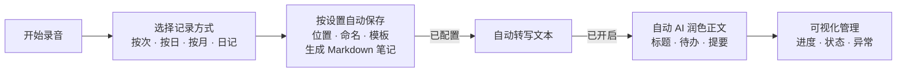
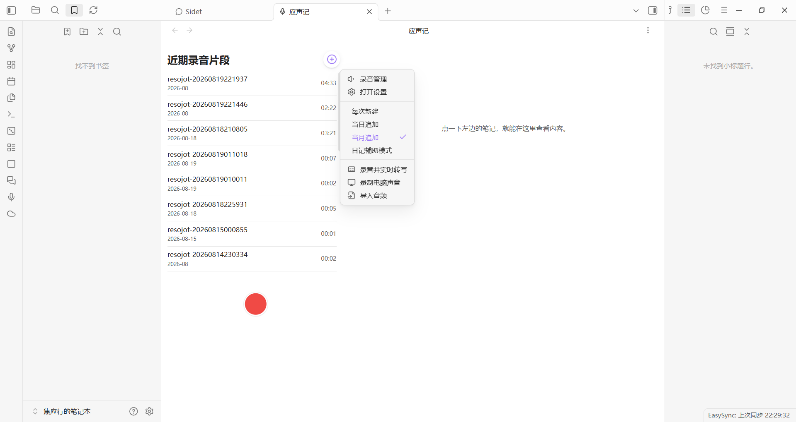

# Resojot 应声记

<p align="center">
  <a href="https://github.com/jiaoyingxing/resojot/releases">
    
  </a>
  <a href="https://github.com/jiaoyingxing/resojot/releases">
    
  </a>
  <a href="./README.md">
    
  </a>
  <a href="./README-en.md">
    
  </a>
</p>

<p align="center">
  <strong>阅读语言：</strong> <strong>简体中文</strong> · <a href="./README-en.md"><strong>English</strong></a>
</p>

Resojot 让语音记录更简单，录音会按你的设置自动保存，并转写、整理成 Obsidian 笔记。打开工作台即可快捷录音，录音状态和后续处理进度都能直接看到。

录音结束后，Resojot 可以按设置自动保存音频、转写文本、AI 润色正文，并提取标题、待办和提要，生成结构化 Markdown 笔记。

保存位置、文件命名、笔记模板和写入方式都可以设置；每段录音可以按次新建，也可以按日、按月汇总，或者写入已有日记。

## 1. ⚙️ 自动处理流程


```mermaid
flowchart LR
    A["开始录音"] --> B["选择记录方式<br/>按次 · 按日 · 按月 · 日记"]
    B --> C["按设置自动保存<br/>位置 · 命名 · 模板<br/>生成 Markdown 笔记"]
    C -->|已配置| D["自动转写文本"]
    D -->|已开启| E["自动 AI 润色正文<br/>标题 · 待办 · 提要"]
    E --> F["可视化管理<br/>进度 · 状态 · 异常"]
```

音频和笔记始终自动保存。转写、AI 润色、标题、待办和提要在相应服务与开关配置完成后自动运行。没有配置转写服务时，任务会显示为“等待配置”，配置后可以继续处理。

<p align="center">
  
</p>

## 2. ✨ 主要功能

| 特点 | 说明 |
|:---|:---|
| ⚡ 快捷录音 | 工作台底部可以直接开始录音。桌面端还可以使用快捷键、命令和按钮；移动端支持 URL 快捷指令。 |
| 🧱 结构化笔记 | 音频、转写文本、润色正文、待办和提要写入 Markdown 笔记，并按内容类型分开显示和继续操作。 |
| 📁 自动结构化存储 | 录音结束后按设置自动保存。音频与笔记位置、文件命名、笔记模板和追加顺序可以分别设置，支持按次、按日、按月和日记辅助。 |
| 🔤 自动转写文本 | 配置本地或云端 ASR 后，录音自动进入转写。可以保存多条服务配置，当前服务失败时尝试其他符合条件的服务。 |
| ✍️ 自动 AI 润色正文 | 开启自动润色后，转写完成会继续整理口语和格式。也可以使用自定义润色操作处理当前正文。 |
| ✅ 自动提取标题与待办 | 可以根据录音内容生成标题或一句话提要，写入文件名或笔记大纲；提取出的待办可以自动汇集到 Todo 笔记。 |
| ⏳ 长音频与恢复 | 长录音分段处理并显示进度。应用关闭、移动端中断或网络波动后，未完成任务会保留，重新打开后可以继续处理。 |
| 📊 可视化管理 | 工作台显示最近的录音笔记；录音管理集中显示转写、润色、失败、笔记缺失和孤立附件，可以取消、重试、恢复笔记和分步清理。 |
| 📥 已有音频 | 可以导入外部音频、处理当前笔记中的音频，也可以重新转写已经完成的结果。 |
| 🌐 界面与设备 | 提供简体中文和 English 界面，常规功能支持 Windows、macOS、iPhone 和 Android。 |

转写和润色结果写在笔记中的标注框里。打开当前标注框的动作菜单，可以重新转写、选择润色方案、提取待办、生成提要、复制或删除。

## 3. 🎁 记录方式与电脑端功能

| 功能 | 说明 |
|:---|:---|
| 🗣️ Windows 听写 | 按住快捷键说话，松开后把文字输入到当前应用。录音可以按设置保留，失败条目仍能回到录音管理中处理。 |
| 💻 电脑声音录制 | 录制电脑正在播放的声音，使用耳机时也可以录制。支持 Windows 和 macOS 13+；macOS 15+ 可以同时录制麦克风。 |
| 📅 日记辅助 | 把普通录音写入 Daily Notes、Periodic Notes、Journals 等工具已经创建的当天日记。Resojot 负责查找和写入，不接管日记创建。 |
| 🧠 本地转写 | 桌面端可以发现、选择、启动和停止用户已经安装的 FunASR 程序。FunASR、Python 环境和模型仍由用户自行安装和准备。 |
| 📱 录音显示 | 可以选择不额外提示、顶部横条或全屏浮窗。普通录音与电脑声音录制使用同一显示设置。 |

## 4. 🖥️ 平台与版本

| 能力 | 要求 |
|:---|:---|
| Resojot 常规功能 | Obsidian `1.11.4+`；支持 Windows、macOS、iPhone 与 Android |
| Windows 听写 | 仅 Windows 桌面端 |
| 电脑声音录制 | Windows 与 macOS 13+ 桌面端；macOS 15+ 可同时录制麦克风 |
| 本地 FunASR 管理 | 桌面端，需要用户已经安装 FunASR 并准备模型 |
| Resojot CLI | Obsidian 桌面端官方安装包 `1.12.7+`，并启用 Command line interface |

## 5. 🧪 Resojot CLI（测试功能）

从 `0.9.10` 起，Codex、Claude Code 等外部 Agent 可以通过官方 Obsidian CLI 调用 Resojot。这项功能目前处于测试阶段。

Agent 可以检查当前环境和插件能力，处理 vault 中已有的音频，查询、重试或取消任务，并取得结果笔记和 artifact。它还可以读取存储与润色设置、查看 FunASR 状态、审计录音管理列表，以及预览选定录音的有限片段。

修改设置、恢复笔记、重试任务或清理条目前，Resojot 会先生成一份精确计划。Agent 需要把计划和影响说明给用户，得到本次确认后才能提交；执行前，Resojot 还会重新检查对象和设置是否发生变化。

- 需要 Obsidian 桌面端 `1.12.7+` 的官方安装包，并在 **设置 → 通用** 中启用 **Command line interface**
- 调用时 Obsidian 与目标 vault 需要保持打开；移动端和旧版宿主不提供 CLI
- 预览没有现成转写的录音时，选定片段可能会发送到当前转写服务，并产生相应费用
- CLI 不公开 API Key、授权码或插件内部队列；测试期间命令参数和可执行范围仍可能调整

最小能力发现：

```shell
obsidian vault="<vault-name-or-id>" resojot
obsidian vault="<vault-name-or-id>" resojot:capabilities
obsidian vault="<vault-name-or-id>" resojot:schema command=resojot:process-audio
```

终端当前目录已经是目标 vault 时，可以省略 `vault=...`。完整参数以当前版本返回的 `resojot:schema` 为准。

## 6. 👀 部分界面展示

> 下面的桌面端截图所示功能同样支持移动端；Resojot 会根据屏幕调整布局。

### 6.1 桌面端截图

**标注框动作菜单**<br>
在当前转写或润色块中继续调用润色方案、待办、提要、复制和删除。

<p align="center">
  
</p>

**存储与写入**<br>
选择笔记写入方式、音频与笔记文件夹、模板和追加顺序。

<p align="center">
  
</p>

**桌面端录音管理**<br>
集中查看失败原因、重试状态和单条录音详情。

<p align="center">
  
</p>

**关于与隐私**<br>
版本、作者入口、隐私、API 服务、使用风险和数据存储说明集中展示。

<p align="center">
  
</p>

### 6.2 移动端截图

| 场景 | 预览 |
|:---|:---|
| **移动端工作台**<br>查看最近录音笔记，并从底部录音按钮开始记录。 |  |
| **工作台快速菜单**<br>从移动端工作台直接进入录音管理、设置、四种写入方式和音频导入。 |  |
| **日记辅助模式**<br>按目录、日期命名规则和板块标题定位已有日记。 |  |
| **润色与附加处理**<br>管理润色服务商、自动润色、待办提取和内容提要。 |  |
| **Todo 笔记**<br>控制自动汇集、笔记位置、显示大小和任务行末操作。 |  |
| **移动端录音管理**<br>在手机上查看取消、无语音、笔记缺失和孤立附件等状态。 |  |

## 7. 🔌 目前接入的服务

| 类型 | 已支持 |
|:---|:---|
| 转写（ASR） | 本地转写服务（兼容 OpenAI 接口；桌面端可管理已安装的 FunASR）<br>云端 OpenAI-compatible 接口<br>硅基流动<br>豆包 ASR<br>腾讯云 ASR<br>阿里云 DashScope ASR<br>小米 MiMo ASR<br>OpenAI<br>Azure Speech<br>Google Speech-to-Text |
| 润色（LLM） | 硅基流动<br>豆包<br>通义千问<br>DeepSeek<br>小米 MiMo<br>OpenAI / ChatGPT<br>Gemini<br>Anthropic / Claude<br>Ollama<br>自定义 OpenAI-compatible 接口 |

> [!NOTE]
> 插件授权不包含第三方云服务额度。服务是否可用、模型权限、费用和请求限制由用户配置的服务商决定。

## 8. 🚀 安装

### 8.1 Obsidian 社区插件（推荐）

1. 打开 Obsidian 的 **设置 → 第三方插件**
2. 选择 **浏览**，搜索 **Resojot**
3. 安装并启用插件

### 8.2 BRAT

1. 在 Obsidian 社区插件中安装 **BRAT**
2. 打开 BRAT，选择 **Add Beta plugin**
3. 输入 `https://github.com/jiaoyingxing/resojot`
4. 安装完成后，在 Obsidian 设置中启用 **Resojot**

> BRAT 可自动从 GitHub Releases 更新，无需手动替换文件。

### 8.3 手动安装

1. 从 [GitHub Releases](https://github.com/jiaoyingxing/resojot/releases) 下载 `main.js`、`manifest.json`、`styles.css`
2. 在 vault 的 `.obsidian/plugins/resojot/` 目录放入上述文件
3. 重启 Obsidian 或重新加载社区插件
4. 在设置中启用 Resojot

## 9. 🔐 授权与隐私

### 9.1 授权状态

| 状态 | 可用功能 |
|:---|:---|
| 🔒 未授权 | 录音、保存音频、基础 Markdown 笔记、基础模板 |
| 🔓 授权后 | 自动转写（含任务队列与失败重试）、导入音频转写、AI 润色，以及依赖润色的待办提取和内容提要 |

- 授权码在本地进行签名校验
- 授权码不包含第三方云服务额度
- 授权期限与适用版本以插件“授权信息”中显示的内容为准
- 获取授权码：小红书搜索 **焦应行**

### 9.2 数据与存储

| 数据 | 存储位置 |
|:---|:---|
| 🎙️ 音频文件、Markdown 笔记 | Obsidian vault（本地） |
| ⚙️ 插件设置、授权状态、待处理状态 | Obsidian 本地插件数据 |
| 🔑 Provider API key、润色 API key、授权码 | Obsidian SecretStorage（设备与 vault 隔离） |

- 插件本身不包含客户端遥测
- 启用云端转写或云端润色时，音频或文字会发送至用户配置的第三方服务

> [!CAUTION]
> 请勿公开 `.obsidian/plugins/resojot/data.json`。该文件可能包含设置、队列状态、授权状态及旧版本遗留的 provider 凭据。

## 10. 👋 联系

- 获取授权码、使用咨询和产品交流：小红书搜索 **焦应行** 🔍
- 部署指南、免费 API 指南、插件使用技巧和交流群信息：[Resojot 应声记](https://my.feishu.cn/wiki/WvpJwybn6iOJXUkCiODcs1d0nIe)
- Bug、可复现问题和功能建议：[GitHub Issues](https://github.com/jiaoyingxing/resojot/issues)

## 11. 📜 许可

- 闭源分发，源码不公开
- 安装与更新可通过 Obsidian 社区插件、BRAT 或 GitHub Releases 进行
- 详见 [LICENSE](./LICENSE)
