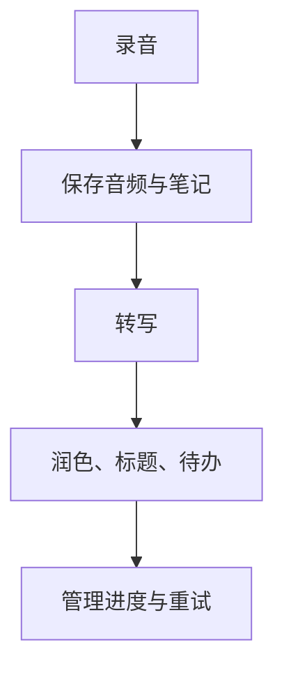

# Resojot 应声记

<p align="center">
  <a href="https://github.com/jiaoyingxing/resojot/releases">
    
  </a>
  <a href="https://github.com/jiaoyingxing/resojot/releases">
    
  </a>
  <a href="./README.md">
    
  </a>
  <a href="./README-en.md">
    
  </a>
</p>

Resojot 让你在 Obsidian 里轻松完成录音、转写和整理，让语音内容更快变成可查、可用的笔记。

## 1. ⚙️ 概览

<p align="center">
  
</p>


```mermaid
flowchart TB
    A["录音"]
    B["保存音频与笔记"]
    C["转写"]
    D["润色、标题、待办"]
    E["管理进度与重试"]
    A --> B --> C --> D --> E
```

## 2. ✨ 核心功能

标注 🔒 的功能需要授权码，其余安装后即可使用。

| 功能 | 说明 |
|:---|:---|
| 🎙️ 内置录音 | 在 Obsidian 里直接录音：工作台一键开始，桌面端可用快捷键和命令，移动端支持 URL 快捷指令。录音数据有本地缓存保护，保存失败不丢失，重启插件后自动恢复。 |
| 📁 自动存入笔记库 | 录音结束自动保存音频，并生成一条 Markdown 笔记：转写文本、润色正文、待办、提要分区写进同一条笔记。存到哪里、怎么命名、用什么模板，都可以设置。 |
| 🔤 自动转写 | 配好转写服务后，录音自动转成文字。常写错的词加入词典就会自动纠正，词典可导出、在设备间迁移；一条服务失败会自动换下一条可用的。 |
| 📝 实时转写 🔒 | 从工作台选择「录音并实时转写」，边录边逐句出字；停止后照常保存音频、继续后续处理。 |
| ⏳ 长录音转写 🔒 | 超过 5 分钟的录音自动分段转写并显示进度；应用重开后，没转完的接着转。 |
| ✍️ AI 润色与整理 | 转写完成后自动把口语稿整理成好读的笔记，可以生成标题和一句话提要；提取的待办自动汇集到 Todo 笔记 🔒。也可以在笔记里随时手动润色、提取待办或纠正用词。 |
| 📊 录音管理 | 工作台显示最近的录音；管理页集中查看每条录音的状态，失败可重试、笔记缺失可恢复、孤立附件可清理。 |

## 3. 🚀 快速开始

**安装**（三选一）：

1. **Obsidian 社区插件（推荐）**：设置 → 第三方插件 → 浏览 → 搜索 **Resojot**，安装并启用
2. **BRAT**：安装 BRAT 后选择 **Add Beta plugin**，输入 `https://github.com/jiaoyingxing/resojot`，之后可自动从 GitHub Releases 更新
3. **手动**：从 [GitHub Releases](https://github.com/jiaoyingxing/resojot/releases) 下载 `main.js`、`manifest.json`、`styles.css` 放入 vault 的 `.obsidian/plugins/resojot/`，重新加载插件并启用

**首次使用**：

1. 在插件设置中选择一个转写服务，可参考知识库的[部署指南与免费 API 指南](https://my.feishu.cn/wiki/WvpJwybn6iOJXUkCiODcs1d0nIe)
2. 从工作台底部按钮开始第一段录音，保存后按设置自动完成转写和润色

不配置授权码也可以使用录音、笔记与 5 分钟以内的转写和润色，完整边界见下方「授权与隐私」。

## 4. 🔌 目前支持的服务

| 类型 | 已支持 |
|:---|:---|
| 转写（ASR） | 本地转写服务（兼容 OpenAI 接口；Windows 桌面端可一键安装或管理 FunASR）<br>云端 OpenAI-compatible 接口<br>硅基流动<br>豆包 ASR<br>腾讯云 ASR<br>阿里云 DashScope ASR<br>小米 MiMo ASR<br>OpenAI<br>Azure Speech<br>Google Speech-to-Text<br>Google Gemini |
| 润色（LLM） | 硅基流动<br>豆包<br>通义千问<br>DeepSeek<br>小米 MiMo<br>OpenAI / ChatGPT<br>Gemini<br>Anthropic / Claude<br>Ollama<br>自定义 OpenAI-compatible 接口 |

> [!NOTE]
> 插件授权不包含第三方云服务额度。服务是否可用、模型权限、费用和请求限制由用户配置的服务商决定。

## 5. 🎁 进阶与桌面端能力

标注 🔒 的功能需要授权码，其余安装后即可使用。

| 功能 | 说明 |
|:---|:---|
| 🏠 本地转写 | Windows 桌面端可以一键安装 FunASR 转写程序并自动准备运行环境，也可以使用已经安装好的 FunASR；首次启用时按需下载模型。 |
| 📅 日记辅助 | 把录音写进 Daily Notes、Periodic Notes、Journals 等工具已经建好的当天日记。Resojot 负责找到日记并写入，不接管日记创建。 |
| 📱 录音显示 | 录音提示全局悬浮显示，录音时可以照常记笔记：可选顶部横条、全屏浮窗或不提示，普通录音和电脑声音录制共用这套设置。 |
| 🗣️ 桌面听写 🔒 | Windows：按住快捷键说话，松开后文字自动输入到当前应用。录音可以按设置保留，失败的条目会回到录音管理。 |
| 💻 电脑声音录制 🔒 | 录制电脑正在播放的声音，戴耳机也可以录；macOS 15+ 还能同时录麦克风。 |
| 👥 话者识别 🔒 | 转写完成后按说话人区分，正文逐句以「发言人 N：」写回。首次使用要在设置的「工具」页获取识别组件（约 38MB，每个 vault 只需下载一次）；超过 1 小时的录音暂不支持。 |
| 📥 已有音频 🔒 | 导入外部音频、处理当前笔记里的音频，或重新转写已完成的结果。 |

## 6. 🖥️ 平台与版本

| 能力 | 要求 |
|:---|:---|
| Resojot 常规功能 | Obsidian `1.11.4+`；支持 Windows、macOS、iPhone 和 Android；界面提供简体中文和 English |
| 多端布局 | 手机、平板、电脑各有专门设计的界面；平板和桌面多窗口下，工作台与设置页按窗口宽度自动调整。 |
| Windows 听写 | 仅 Windows 桌面端 |
| 电脑声音录制 | Windows 与 macOS 13+ 桌面端；macOS 15+ 可同时录制麦克风 |
| 本地 FunASR 管理 | 桌面端；Windows 支持一键安装 FunASR 与运行环境，也可管理已安装的 FunASR |
| Resojot CLI | Obsidian 桌面端官方安装包 `1.12.7+`，并启用 Command line interface |

## 7. 👀 部分界面展示

> 下面的桌面端截图所示功能同样支持移动端；Resojot 会根据屏幕调整布局。

### 7.1 桌面端截图

**转写与润色动作菜单**<br>
打开「AI润色」，或使用「用词纠错」、复制和删除。

<p align="center">
  
</p>

**存储与写入**<br>
选择笔记写入方式、音频与笔记文件夹、模板和追加顺序。

<p align="center">
  
</p>

**桌面端录音管理**<br>
集中查看失败原因、重试状态和单条录音详情。

<p align="center">
  
</p>

### 7.2 移动端截图

| 场景 | 预览 |
|:---|:---|
| **移动端工作台**<br>查看最近录音笔记，并从底部录音按钮开始记录。 |  |
| **工作台快速菜单**<br>从移动端工作台直接进入录音管理、设置、四种写入方式和音频导入。 |  |
| **日记辅助模式**<br>按目录、日期命名规则和板块标题定位已有日记。 |  |
| **AI 润色与附加处理**<br>从内容动作菜单打开「AI润色」，选择或新建润色方案、提取待办和生成提要。 |  |
| **Todo 笔记**<br>控制自动汇集、笔记位置、显示大小和任务行末操作。 |  |
| **音频播放条操作**<br>调整播放速度、转写这段音频，或删除录音（仍被笔记引用时保留音频文件）。 |  |
| **移动端录音管理**<br>在手机上查看取消、无语音、笔记缺失和孤立附件等状态。 |  |

## 8. 🧪 Resojot CLI（测试功能）

Codex、Claude Code 等外部 Agent 可以通过官方 Obsidian CLI 调用 Resojot。Agent 可以检查当前环境和插件能力，发起或停止录音、处理 vault 中已有的音频，查询、重试或取消任务，并取得结果笔记和 artifact；也可以读取存储与润色设置、查看 FunASR 状态、读写术语词典、审计录音管理列表，以及预览选定录音的有限片段。

修改设置、恢复笔记、重试任务或清理条目前，Resojot 会先生成一份精确计划；Agent 需要把计划和影响说明给用户，得到本次确认后才能提交，执行前还会重新检查对象和设置是否发生变化。

- 需要 Obsidian 桌面端官方安装包 `1.12.7+`，并在 **设置 → 通用** 中启用 **Command line interface**；调用时 Obsidian 与目标 vault 需要保持打开，移动端不提供
- 预览没有现成转写的录音时，选定片段可能会发送到当前转写服务，并产生相应费用
- CLI 不公开 API Key、授权码或插件内部队列；测试期间命令参数和可执行范围仍可能调整

最小能力发现：

```shell
obsidian vault="<vault-name-or-id>" resojot
obsidian vault="<vault-name-or-id>" resojot:capabilities
obsidian vault="<vault-name-or-id>" resojot:schema command=resojot:process-audio
```

终端当前目录已经是目标 vault 时，可以省略 `vault=...`。完整参数以当前版本返回的 `resojot:schema` 为准。

## 9. 🔐 授权与隐私

### 9.1 授权状态

| 状态 | 可用功能 |
|:---|:---|
| 🔓 免费 | 录音、保存音频、基础 Markdown 笔记与模板；5 分钟以内录音的转写、自动润色与标题生成；对已有转写手动发起润色与提取待办；使用已有润色方案 |
| 🔒 需要授权 | 超过 5 分钟的录音转写、导入音频转写、录制电脑音频、桌面听写、实时转写（边录边出字）、Todo 收集、话者识别（发言人补标）、润色方案的管理 |

- 获取授权码：小红书搜索 **焦应行** 🔍
- 授权码在本地进行签名校验；授权期限与适用版本以插件「授权信息」中显示的内容为准

### 9.2 数据与存储

| 数据 | 存储位置 |
|:---|:---|
| 🎙️ 音频文件、Markdown 笔记 | Obsidian vault（本地） |
| ⚙️ 插件设置、词典、授权状态、待处理状态 | Obsidian 本地插件数据 |
| 🔑 Provider API key、润色 API key、授权码 | Obsidian SecretStorage（设备与 vault 隔离） |

- 插件本身不包含客户端遥测
- 启用云端转写或云端润色时，音频或文字会发送至用户配置的第三方服务
- 导出的词典 Markdown 是明文迁移文件，可能被同步、备份或搜索工具读取；导入前会由用户确认，不会静默替换正在使用的词典

> [!CAUTION]
> 请勿公开 `.obsidian/plugins/resojot/data.json`。该文件可能包含设置、队列状态、授权状态及旧版本遗留的 provider 凭据。

## 10. 💬 反馈与支持

- 部署指南、免费 API 指南与使用技巧：[Resojot 应声记知识库](https://my.feishu.cn/wiki/WvpJwybn6iOJXUkCiODcs1d0nIe)
- Bug、可复现问题和功能建议：[GitHub Issues](https://github.com/jiaoyingxing/resojot/issues)
- 使用交流与产品动态：小红书搜索 **焦应行** 🔍

## 11. 📜 许可

- 闭源分发，源码不公开
- 话者识别的推理运行时使用 [onnxruntime-web](https://github.com/microsoft/onnxruntime)（MIT License）；识别模型来自各发布方的公开版本，其许可与使用条款以发布方说明为准
- 安装与更新可通过 Obsidian 社区插件、BRAT 或 GitHub Releases 进行
- 详见 [LICENSE](./LICENSE)
